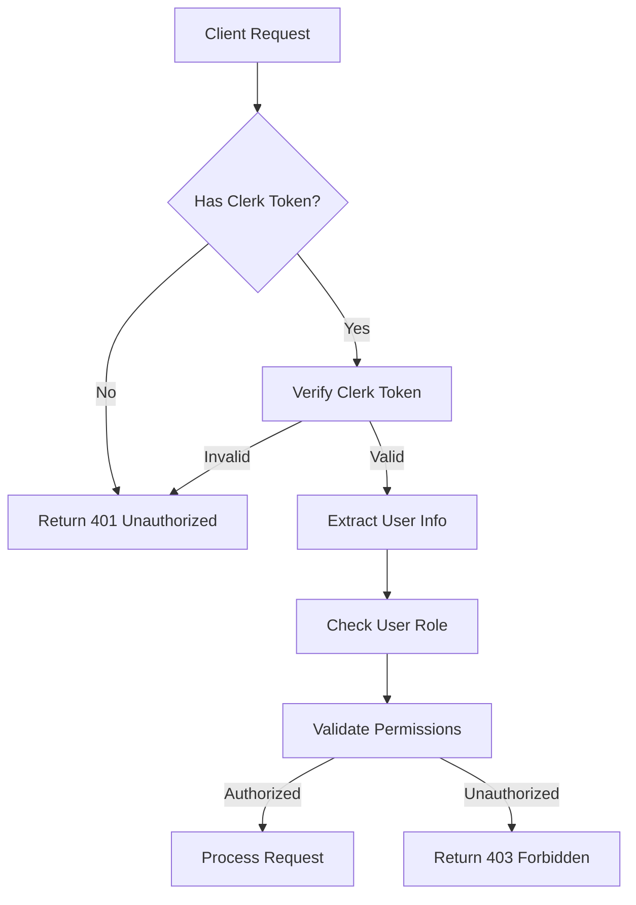

# 🚀 AI-Driven Recruitment Backend - Implementation Plan

## 📋 Project Overview

This document outlines the complete implementation plan for adding Clerk authentication with Role-Based Access Control (RBAC) and implementing all missing API endpoints while preserving existing functionality.

---

## 🔐 Authentication & RBAC Implementation

### Clerk Integration Strategy

#### Authentication Flow


#### RBAC Matrix

| Role | Admin | Manager | Recruiter | Candidate |
|------|-------|---------|-----------|----------|
| **User Management** | ✅ Full | ✅ View Team | ❌ | ❌ |
| **Role Management** | ✅ Full | ❌ | ❌ | ❌ |
| **Settings** | ✅ Full | ✅ Team Settings | ❌ | ❌ |
| **Job Management** | ✅ Full | ✅ Full | ✅ Assigned | ❌ |
| **Candidate Management** | ✅ Full | ✅ Team View | ✅ Assigned | ✅ Own Profile |
| **Analytics** | ✅ Full | ✅ Team Analytics | ✅ Personal | ✅ Personal |
| **Communication** | ✅ Full | ✅ Team | ✅ Candidates | ✅ Recruiters |

#### Implementation Components

1. **Clerk Middleware** (`app/middleware/clerk_auth.py`)
   - Token verification
   - User context extraction
   - Role assignment

2. **Permission Decorators** (`app/auth/permissions.py`)
   - `@require_role(roles: List[str])`
   - `@require_permission(permission: str)`
   - `@require_ownership(resource: str)`

3. **User Context** (`app/auth/context.py`)
   - Current user information
   - Role and permissions
   - Tenant/organization context

---

## 🛠️ API Endpoints Implementation

### Phase 1: Critical Core APIs (Week 1-2)

#### Admin Role Management
```python
# Route: /api/admin/roles
class RoleManagementAPI:
    GET /api/admin/roles                    # List all roles
    POST /api/admin/roles                   # Create custom role
    PUT /api/admin/roles/{role_id}          # Update role permissions
    DELETE /api/admin/roles/{role_id}       # Delete role
    GET /api/admin/roles/{role_id}/permissions  # Get role permissions
```

#### Admin Settings & Configuration
```python
# Route: /api/admin/settings
class AdminSettingsAPI:
    GET /api/admin/settings                 # Get tenant settings
    PUT /api/admin/settings                 # Update tenant settings
    GET /api/admin/settings/email-templates # Get email templates
    PUT /api/admin/settings/email-templates # Update email templates
```

#### Manager Performance Management
```python
# Route: /api/manager/recruiters
class ManagerRecruiterAPI:
    GET /api/manager/recruiters/{id}/performance    # Get performance metrics
    GET /api/manager/recruiters/{id}/candidates     # Get assigned candidates
    GET /api/manager/recruiters/{id}/jobs          # Get assigned jobs
    PUT /api/manager/recruiters/{id}/assign-job    # Assign job to recruiter
    POST /api/manager/recruiters/{id}/feedback     # Provide feedback
```

### Phase 2: Essential Features (Week 3-4)

#### Recruiter Application Management
```python
# Route: /api/recruiter/applications
class RecruiterApplicationAPI:
    POST /api/recruiter/applications/{id}/feedback  # Add detailed feedback
    GET /api/recruiter/applications/{id}/feedback   # Get feedback history
```

#### Interview Management System
```python
# Route: /api/recruiter/interviews
class InterviewManagementAPI:
    GET /api/recruiter/interviews/{id}              # Get interview details
    PUT /api/recruiter/interviews/{id}              # Update interview
    DELETE /api/recruiter/interviews/{id}           # Cancel interview
    POST /api/recruiter/interviews/{id}/feedback    # Add interview feedback
    GET /api/recruiter/interviews/{id}/feedback     # Get interview feedback
```

#### Communication System
```python
# Route: /api/recruiter/messages
class CommunicationAPI:
    GET /api/recruiter/messages                     # List all messages
    GET /api/recruiter/messages/{id}               # Get message details
    POST /api/recruiter/messages                   # Send message
    PUT /api/recruiter/messages/{id}/read          # Mark as read
    GET /api/recruiter/calls                       # List call logs
    POST /api/recruiter/calls                      # Log call activity
```

### Phase 3: User Experience (Week 5-6)

#### Candidate Authentication & Security
```python
# Route: /api/auth/candidate
class CandidateAuthAPI:
    PUT /api/auth/candidate/password               # Change password
    POST /api/auth/candidate/forgot-password       # Forgot password
    POST /api/auth/candidate/reset-password        # Reset password
```

#### Candidate Profile Management
```python
# Route: /api/candidate
class CandidateProfileAPI:
    GET /api/candidate/skills                      # List skills
    POST /api/candidate/skills                     # Add skill
    PUT /api/candidate/skills/{id}                 # Update skill
    DELETE /api/candidate/skills/{id}              # Remove skill
    
    GET /api/candidate/experience                  # List experience
    POST /api/candidate/experience                 # Add experience
    PUT /api/candidate/experience/{id}             # Update experience
    DELETE /api/candidate/experience/{id}          # Remove experience
    
    GET /api/candidate/education                   # List education
    POST /api/candidate/education                  # Add education
    PUT /api/candidate/education/{id}              # Update education
    DELETE /api/candidate/education/{id}           # Remove education
```

#### Document Management
```python
# Route: /api/candidate/documents
class DocumentManagementAPI:
    GET /api/candidate/resume                      # Get resume
    POST /api/candidate/resume                     # Upload resume
    PUT /api/candidate/resume                      # Update resume
    DELETE /api/candidate/resume                   # Delete resume
    
    GET /api/candidate/documents                   # List documents
    POST /api/candidate/documents                  # Upload document
    DELETE /api/candidate/documents/{id}           # Delete document
```

### Phase 4: Advanced Features (Week 7-8)

#### Analytics & Reporting
```python
# Route: /api/analytics
class AnalyticsAPI:
    GET /api/recruiter/analytics/candidates        # Candidate analytics
    GET /api/recruiter/analytics/jobs             # Job analytics
    GET /api/recruiter/analytics/interviews       # Interview analytics
    GET /api/candidate/analytics/applications     # Application analytics
```

#### Real-time Features
```python
# WebSocket Routes
class RealtimeAPI:
    WS /api/websocket/notifications               # Real-time notifications
    WS /api/websocket/messages                    # Real-time messaging
    WS /api/websocket/status                      # Real-time status updates
```

---

## 🗄️ Database Schema Design

### New Tables Required

#### User Management & RBAC
```sql
-- Roles and Permissions
CREATE TABLE roles (
    id UUID PRIMARY KEY DEFAULT gen_random_uuid(),
    name VARCHAR(100) NOT NULL UNIQUE,
    description TEXT,
    is_system_role BOOLEAN DEFAULT FALSE,
    tenant_id UUID REFERENCES tenants(id),
    created_at TIMESTAMP DEFAULT NOW(),
    updated_at TIMESTAMP DEFAULT NOW()
);

CREATE TABLE permissions (
    id UUID PRIMARY KEY DEFAULT gen_random_uuid(),
    name VARCHAR(100) NOT NULL UNIQUE,
    resource VARCHAR(100) NOT NULL,
    action VARCHAR(50) NOT NULL,
    description TEXT,
    created_at TIMESTAMP DEFAULT NOW()
);

CREATE TABLE role_permissions (
    role_id UUID REFERENCES roles(id) ON DELETE CASCADE,
    permission_id UUID REFERENCES permissions(id) ON DELETE CASCADE,
    PRIMARY KEY (role_id, permission_id)
);

CREATE TABLE user_roles (
    user_id UUID NOT NULL,
    role_id UUID REFERENCES roles(id) ON DELETE CASCADE,
    assigned_by UUID,
    assigned_at TIMESTAMP DEFAULT NOW(),
    PRIMARY KEY (user_id, role_id)
);
```

#### Tenant Settings
```sql
CREATE TABLE tenant_settings (
    id UUID PRIMARY KEY DEFAULT gen_random_uuid(),
    tenant_id UUID NOT NULL,
    setting_key VARCHAR(100) NOT NULL,
    setting_value JSONB,
    created_at TIMESTAMP DEFAULT NOW(),
    updated_at TIMESTAMP DEFAULT NOW(),
    UNIQUE(tenant_id, setting_key)
);

CREATE TABLE email_templates (
    id UUID PRIMARY KEY DEFAULT gen_random_uuid(),
    tenant_id UUID NOT NULL,
    template_name VARCHAR(100) NOT NULL,
    subject VARCHAR(255) NOT NULL,
    body_html TEXT,
    body_text TEXT,
    variables JSONB,
    is_active BOOLEAN DEFAULT TRUE,
    created_at TIMESTAMP DEFAULT NOW(),
    updated_at TIMESTAMP DEFAULT NOW(),
    UNIQUE(tenant_id, template_name)
);
```

#### Communication System
```sql
CREATE TABLE messages (
    id UUID PRIMARY KEY DEFAULT gen_random_uuid(),
    sender_id UUID NOT NULL,
    recipient_id UUID NOT NULL,
    subject VARCHAR(255),
    content TEXT NOT NULL,
    message_type VARCHAR(50) DEFAULT 'direct',
    is_read BOOLEAN DEFAULT FALSE,
    read_at TIMESTAMP,
    created_at TIMESTAMP DEFAULT NOW(),
    updated_at TIMESTAMP DEFAULT NOW()
);

CREATE TABLE call_logs (
    id UUID PRIMARY KEY DEFAULT gen_random_uuid(),
    recruiter_id UUID NOT NULL,
    candidate_id UUID NOT NULL,
    call_type VARCHAR(50) NOT NULL,
    duration_minutes INTEGER,
    notes TEXT,
    outcome VARCHAR(100),
    scheduled_at TIMESTAMP,
    completed_at TIMESTAMP,
    created_at TIMESTAMP DEFAULT NOW()
);
```

#### Candidate Profile Extensions
```sql
CREATE TABLE candidate_skills (
    id UUID PRIMARY KEY DEFAULT gen_random_uuid(),
    candidate_id UUID NOT NULL,
    skill_name VARCHAR(100) NOT NULL,
    proficiency_level VARCHAR(50),
    years_experience INTEGER,
    is_verified BOOLEAN DEFAULT FALSE,
    created_at TIMESTAMP DEFAULT NOW(),
    updated_at TIMESTAMP DEFAULT NOW()
);

CREATE TABLE candidate_experience (
    id UUID PRIMARY KEY DEFAULT gen_random_uuid(),
    candidate_id UUID NOT NULL,
    company_name VARCHAR(200) NOT NULL,
    job_title VARCHAR(200) NOT NULL,
    description TEXT,
    start_date DATE NOT NULL,
    end_date DATE,
    is_current BOOLEAN DEFAULT FALSE,
    created_at TIMESTAMP DEFAULT NOW(),
    updated_at TIMESTAMP DEFAULT NOW()
);

CREATE TABLE candidate_education (
    id UUID PRIMARY KEY DEFAULT gen_random_uuid(),
    candidate_id UUID NOT NULL,
    institution_name VARCHAR(200) NOT NULL,
    degree VARCHAR(100) NOT NULL,
    field_of_study VARCHAR(100),
    start_date DATE,
    end_date DATE,
    gpa DECIMAL(3,2),
    created_at TIMESTAMP DEFAULT NOW(),
    updated_at TIMESTAMP DEFAULT NOW()
);
```

#### Feedback & Analytics
```sql
CREATE TABLE application_feedback (
    id UUID PRIMARY KEY DEFAULT gen_random_uuid(),
    application_id UUID NOT NULL,
    recruiter_id UUID NOT NULL,
    feedback_type VARCHAR(50) NOT NULL,
    rating INTEGER CHECK (rating >= 1 AND rating <= 5),
    comments TEXT,
    created_at TIMESTAMP DEFAULT NOW()
);

CREATE TABLE interview_feedback (
    id UUID PRIMARY KEY DEFAULT gen_random_uuid(),
    interview_id UUID NOT NULL,
    interviewer_id UUID NOT NULL,
    candidate_id UUID NOT NULL,
    technical_rating INTEGER CHECK (technical_rating >= 1 AND technical_rating <= 5),
    communication_rating INTEGER CHECK (communication_rating >= 1 AND communication_rating <= 5),
    cultural_fit_rating INTEGER CHECK (cultural_fit_rating >= 1 AND cultural_fit_rating <= 5),
    overall_recommendation VARCHAR(50),
    detailed_feedback TEXT,
    created_at TIMESTAMP DEFAULT NOW()
);
```

#### Document Management
```sql
CREATE TABLE documents (
    id UUID PRIMARY KEY DEFAULT gen_random_uuid(),
    owner_id UUID NOT NULL,
    owner_type VARCHAR(50) NOT NULL, -- 'candidate', 'recruiter', 'admin'
    document_type VARCHAR(100) NOT NULL,
    file_name VARCHAR(255) NOT NULL,
    file_path VARCHAR(500) NOT NULL,
    file_size INTEGER,
    mime_type VARCHAR(100),
    is_public BOOLEAN DEFAULT FALSE,
    created_at TIMESTAMP DEFAULT NOW(),
    updated_at TIMESTAMP DEFAULT NOW()
);

CREATE TABLE saved_jobs (
    id UUID PRIMARY KEY DEFAULT gen_random_uuid(),
    candidate_id UUID NOT NULL,
    job_id UUID NOT NULL,
    saved_at TIMESTAMP DEFAULT NOW(),
    UNIQUE(candidate_id, job_id)
);
```

#### Notifications System
```sql
CREATE TABLE notifications (
    id UUID PRIMARY KEY DEFAULT gen_random_uuid(),
    user_id UUID NOT NULL,
    notification_type VARCHAR(100) NOT NULL,
    title VARCHAR(255) NOT NULL,
    message TEXT NOT NULL,
    data JSONB,
    is_read BOOLEAN DEFAULT FALSE,
    read_at TIMESTAMP,
    created_at TIMESTAMP DEFAULT NOW()
);
```

### Database Migration Strategy

1. **Backward Compatibility**: All new tables and columns are additive
2. **Data Migration**: Existing data remains untouched
3. **Rollback Plan**: Each migration includes rollback scripts
4. **Performance**: Indexes added for all foreign keys and frequently queried columns

---

## 🔧 Technical Implementation Details

### Project Structure
```
app/
├── auth/
│   ├── __init__.py
│   ├── clerk_client.py      # Clerk SDK integration
│   ├── permissions.py       # Permission decorators
│   ├── context.py          # User context management
│   └── middleware.py       # Authentication middleware
├── models/
│   ├── auth.py             # User, Role, Permission models
│   ├── communication.py    # Message, CallLog models
│   ├── candidate.py        # Extended candidate models
│   ├── feedback.py         # Feedback models
│   └── documents.py        # Document models
├── routers/
│   ├── admin/
│   │   ├── roles.py        # Role management endpoints
│   │   └── settings.py     # Settings management
│   ├── manager/
│   │   └── recruiters.py   # Recruiter management
│   ├── recruiter/
│   │   ├── applications.py # Application management
│   │   ├── interviews.py   # Interview management
│   │   ├── messages.py     # Communication
│   │   └── analytics.py    # Analytics
│   └── candidate/
│       ├── auth.py         # Authentication
│       ├── profile.py      # Profile management
│       ├── applications.py # Application management
│       └── documents.py    # Document management
├── services/
│   ├── notification.py     # Notification service
│   ├── email.py           # Email service
│   ├── file_upload.py     # File upload service
│   └── analytics.py       # Analytics service
└── utils/
    ├── validators.py       # Input validation
    ├── exceptions.py       # Custom exceptions
    └── helpers.py         # Utility functions
```

### Security Implementation

#### Authentication Middleware
```python
# app/auth/middleware.py
from clerk_backend_api import Clerk
from fastapi import HTTPException, Request
from fastapi.security import HTTPBearer

class ClerkAuthMiddleware:
    def __init__(self, clerk_secret_key: str):
        self.clerk = Clerk(bearer_auth=clerk_secret_key)
    
    async def verify_token(self, request: Request):
        # Extract and verify Clerk JWT token
        # Set user context in request state
        pass
```

#### Permission Decorators
```python
# app/auth/permissions.py
from functools import wraps
from fastapi import HTTPException, Depends

def require_role(*roles: str):
    def decorator(func):
        @wraps(func)
        async def wrapper(*args, **kwargs):
            # Check if current user has required role
            pass
        return wrapper
    return decorator

def require_permission(permission: str):
    def decorator(func):
        @wraps(func)
        async def wrapper(*args, **kwargs):
            # Check if current user has required permission
            pass
        return wrapper
    return decorator
```

### API Response Models

#### Standard Response Format
```python
# app/models/responses.py
from pydantic import BaseModel
from typing import Optional, Any, List

class APIResponse(BaseModel):
    success: bool
    message: str
    data: Optional[Any] = None
    errors: Optional[List[str]] = None
    meta: Optional[dict] = None

class PaginatedResponse(APIResponse):
    data: List[Any]
    meta: dict  # Contains pagination info
```

### Error Handling

#### Custom Exceptions
```python
# app/utils/exceptions.py
class AuthenticationError(Exception):
    pass

class AuthorizationError(Exception):
    pass

class ValidationError(Exception):
    pass

class ResourceNotFoundError(Exception):
    pass
```

---

## 📊 Implementation Timeline

### Week 1-2: Foundation & Core APIs
- [ ] Set up Clerk authentication integration
- [ ] Implement RBAC system
- [ ] Create database migrations
- [ ] Implement admin role management APIs
- [ ] Implement admin settings APIs
- [ ] Add comprehensive testing

### Week 3-4: Essential Features
- [ ] Implement manager recruiter management APIs
- [ ] Create recruiter application feedback system
- [ ] Build interview management system
- [ ] Implement communication APIs
- [ ] Add document management

### Week 5-6: User Experience
- [ ] Implement candidate authentication security
- [ ] Build candidate profile management
- [ ] Create job application management
- [ ] Implement notification system
- [ ] Add analytics endpoints

### Week 7-8: Advanced Features
- [ ] Implement real-time features (WebSocket)
- [ ] Add advanced analytics
- [ ] Create integration APIs
- [ ] Performance optimization
- [ ] Final testing and documentation

---

## 🎯 Success Criteria

### Functional Requirements
- [ ] All API endpoints implemented and tested
- [ ] Clerk authentication fully integrated
- [ ] RBAC system working correctly
- [ ] Database schema supports all features
- [ ] Backward compatibility maintained

### Performance Requirements
- [ ] API response time < 200ms for 95% of requests
- [ ] Database queries optimized
- [ ] File upload/download working efficiently
- [ ] Real-time features responsive

### Security Requirements
- [ ] All endpoints properly authenticated
- [ ] Role-based access control enforced
- [ ] Input validation and sanitization
- [ ] Secure file upload handling
- [ ] Rate limiting implemented

### Quality Requirements
- [ ] 90%+ test coverage
- [ ] Comprehensive API documentation
- [ ] Error handling and logging
- [ ] Code review and quality checks

---

## 📚 Documentation & Testing

### API Documentation
- Interactive Swagger/OpenAPI documentation
- Postman collection for testing
- Authentication guide
- Role and permission matrix

### Testing Strategy
- Unit tests for all business logic
- Integration tests for API endpoints
- Authentication and authorization tests
- Performance and load testing
- Security testing

### Monitoring & Logging
- API usage analytics
- Error tracking and alerting
- Performance monitoring
- Security audit logging

---

This implementation plan provides a comprehensive roadmap for adding Clerk authentication with RBAC and implementing all missing API endpoints while maintaining backward compatibility and ensuring high code quality.